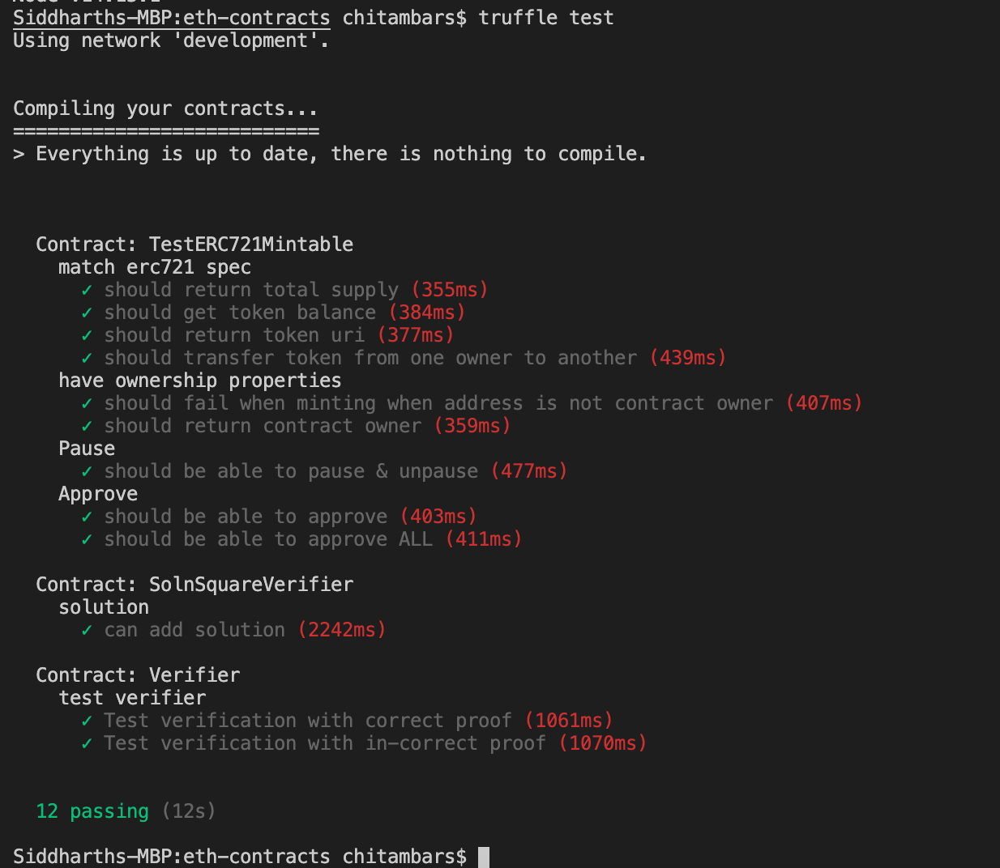
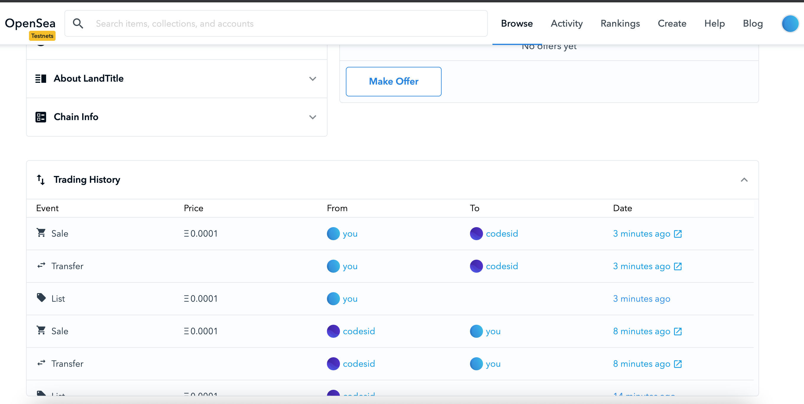

# Udacity Blockchain Capstone

The capstone will build upon the knowledge you have gained in the course in order to build a decentralized housing product. 


# Commands used

# Truffle

```
truffle compile

truffle test

truffle migrate --reset

TO RINKEBY

truffle migrate --network rinkeby
```

## TRUFFLE TESTS



## MINTING 10 TOKENS
```
node exec zokrates/code/square/minting.js
```

### MINTED 10 
```
Transaction: 0xb5ba3631ffec7a4f70bf9b9383f53dfbc5c58fed5040c425175208bf1e08afb6
Transaction: 0x5326463272e3067187c068ae043c8d89590791cd3205994fb4cf6ab0ecd78acb
Transaction: 0xcf3cdf2c73588e9b000750a882f8658b48c24a77a11fe50ccf7ae893153672f9
Transaction: 0xa323bd8b654207c32757b018357709f855b978e41e7137c97dced6da336b8a42
Transaction: 0x8ee5cfa9661440a6af7c639702d494c45f0bb3a41390068230f732b24a6bffe4
Transaction: 0x0397d5ba9b56274a7c2be7476f536328249dab6aa155319e8c344460c55615a0
Transaction: 0x41850dd55cd951ae993deb3f1cd56af1f04930b8c9f5cda30c89b0ee62b8a030
Transaction: 0x999d6ea656f9c10a9e00a27e662a6ab62b99e41f94aeb576a3cd3c35641bcc02
Transaction: 0x9c7d6b9a95564e591d24b0b6c5d56c1d8eb40931de79021514aac7f7323e2049
Transaction: 0xa88f34448a62b7294a0cc2e288b3c25861f23e6516a4ab11b3f6850786a01a9
```

### Transactions

https://rinkeby.etherscan.io/tx/0xcbb798cda54b5658f0f8702704df753fdbfd92efaf8090b73aabdd766e2dee53

https://rinkeby.etherscan.io/tx/0x3945fa13abf87c184caeb10b93fd1f926b435889cd0c84133863a0f59640599b

Open Sea
https://testnets.opensea.io/assets/0xad28beb95ca06355d6215ab30656b40bf287dabd/2




## Deployment to Rinkeby

```
truffle migrate --network rinkeby

Compiling your contracts...
===========================
> Everything is up to date, there is nothing to compile.


Migrations dry-run (simulation)
===============================
> Network name:    'rinkeby-fork'
> Network id:      4
> Block gas limit: 10000000 (0x989680)


1_initial_migration.js
======================

   Deploying 'Migrations'
   ----------------------
   > block number:        8011519
   > block timestamp:     1612401047
   > account:             0x47144fD98DAe2eCF1a802f2dd964EEDdcC2C6455
   > balance:             15.659429750999999999
   > gas used:            208305 (0x32db1)
   > gas price:           10 gwei
   > value sent:          0 ETH
   > total cost:          0.00208305 ETH

   -------------------------------------
   > Total cost:          0.00208305 ETH


2_deploy_contracts.js
=====================

   Deploying 'LandTitle'
   ---------------------
   > block number:        8011521
   > block timestamp:     1612401054
   > account:             0x47144fD98DAe2eCF1a802f2dd964EEDdcC2C6455
   > balance:             15.635233560999999999
   > gas used:            2392256 (0x2480c0)
   > gas price:           10 gwei
   > value sent:          0 ETH
   > total cost:          0.02392256 ETH


   Deploying 'Verifier'
   --------------------
   > block number:        8011522
   > block timestamp:     1612401057
   > account:             0x47144fD98DAe2eCF1a802f2dd964EEDdcC2C6455
   > balance:             15.625572370999999999
   > gas used:            966119 (0xebde7)
   > gas price:           10 gwei
   > value sent:          0 ETH
   > total cost:          0.00966119 ETH


   Deploying 'SolnSquareVerifier'
   ------------------------------
   > block number:        8011523
   > block timestamp:     1612401063
   > account:             0x47144fD98DAe2eCF1a802f2dd964EEDdcC2C6455
   > balance:             15.595858320999999999
   > gas used:            2971405 (0x2d570d)
   > gas price:           10 gwei
   > value sent:          0 ETH
   > total cost:          0.02971405 ETH

   -------------------------------------
   > Total cost:           0.0632978 ETH


Summary
=======
> Total deployments:   4
> Final cost:          0.06538085 ETH


Starting migrations...
======================
> Network name:    'rinkeby'
> Network id:      4
> Block gas limit: 10000000 (0x989680)


1_initial_migration.js
======================

   Deploying 'Migrations'
   ----------------------
   > transaction hash:    0x83aff3afeeb1c104964575bcccd7115ac4670a93748b54bf4c5fd45d5bb74fe5
   > Blocks: 2            Seconds: 16
   > contract address:    0xF81546924D9648960e5EdA2bf5F2F3c323ad15B2
   > block number:        8011520
   > block timestamp:     1612401088
   > account:             0x47144fD98DAe2eCF1a802f2dd964EEDdcC2C6455
   > balance:             15.659279750999999999
   > gas used:            223305 (0x36849)
   > gas price:           10 gwei
   > value sent:          0 ETH
   > total cost:          0.00223305 ETH


   > Saving migration to chain.
   > Saving artifacts
   -------------------------------------
   > Total cost:          0.00223305 ETH


2_deploy_contracts.js
=====================

   Deploying 'LandTitle'
   ---------------------
   > transaction hash:    0xdb2a01fc9c83abeca5f6745e8cce016455bc9455fc0fa192799b82f4a35c3bfb
   > Blocks: 0            Seconds: 12
   > contract address:    0x911c31392fB982f963Cfeae79b7A419a5AAf13f1
   > block number:        8011522
   > block timestamp:     1612401118
   > account:             0x47144fD98DAe2eCF1a802f2dd964EEDdcC2C6455
   > balance:             15.633433560999999999
   > gas used:            2542256 (0x26cab0)
   > gas price:           10 gwei
   > value sent:          0 ETH
   > total cost:          0.02542256 ETH


   Deploying 'Verifier'
   --------------------
   > transaction hash:    0xbc8bdccca468070bc6880ac2d79b5a758c5c85083fbdf4c6b97fd9538e73e87e
   > Blocks: 0            Seconds: 12
   > contract address:    0x96f6c7FB280b1bcfAE1cC031c435e53E0eA71cD8
   > block number:        8011523
   > block timestamp:     1612401133
   > account:             0x47144fD98DAe2eCF1a802f2dd964EEDdcC2C6455
   > balance:             15.623772370999999999
   > gas used:            966119 (0xebde7)
   > gas price:           10 gwei
   > value sent:          0 ETH
   > total cost:          0.00966119 ETH


   Deploying 'SolnSquareVerifier'
   ------------------------------
   > transaction hash:    0xb712e39b01679d22de9f30469f9fd11f0e0081c0a088232535256ffa453f02db
   > Blocks: 0            Seconds: 8
   > contract address:    0xad28Beb95CA06355d6215ab30656B40BF287DAbd
   > block number:        8011524
   > block timestamp:     1612401148
   > account:             0x47144fD98DAe2eCF1a802f2dd964EEDdcC2C6455
   > balance:             15.592408320999999999
   > gas used:            3136405 (0x2fdb95)
   > gas price:           10 gwei
   > value sent:          0 ETH
   > total cost:          0.03136405 ETH


   > Saving migration to chain.
   > Saving artifacts
   -------------------------------------
   > Total cost:           0.0664478 ETH


Summary
=======
> Total deployments:   4
> Final cost:          0.06868085 ETH
```

# Zokrates

```zokrates compile -i square.code```

```zokrates setup```

```zokrates compute-witness -a 3 9 ```

```zokrates generate-proof```

```zokrates export-verifier```

# Project Resources

* [Remix - Solidity IDE](https://remix.ethereum.org/)
* [Visual Studio Code](https://code.visualstudio.com/)
* [Truffle Framework](https://truffleframework.com/)
* [Ganache - One Click Blockchain](https://truffleframework.com/ganache)
* [Open Zeppelin ](https://openzeppelin.org/)
* [Interactive zero knowledge 3-colorability demonstration](http://web.mit.edu/~ezyang/Public/graph/svg.html)
* [Docker](https://docs.docker.com/install/)
* [ZoKrates](https://github.com/Zokrates/ZoKrates)
